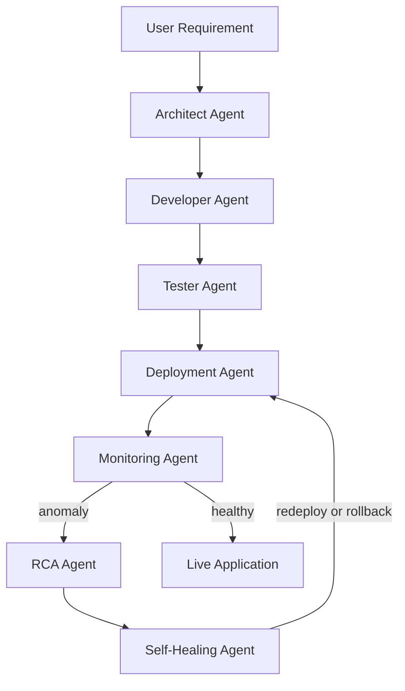
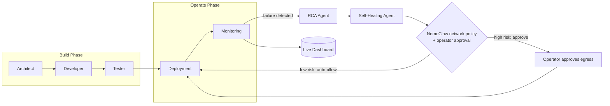
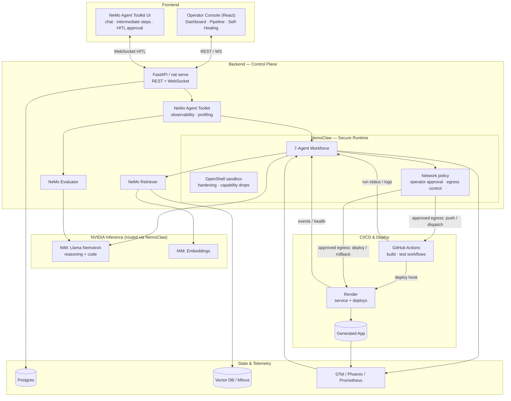
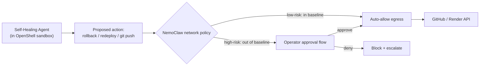
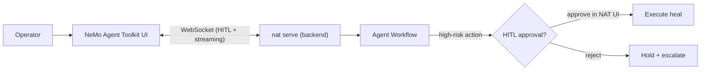
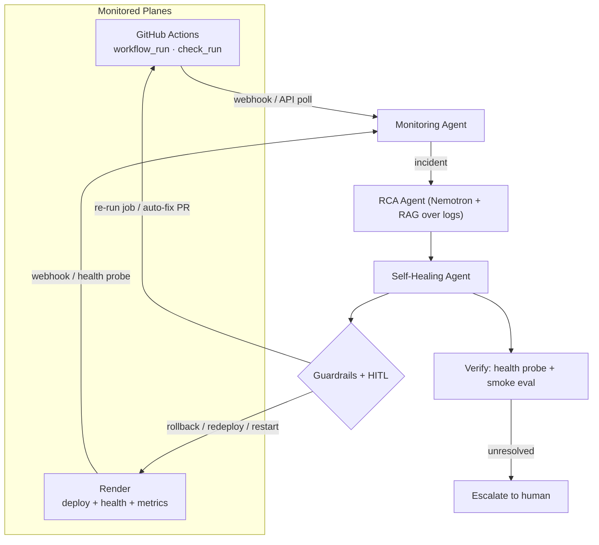

# AI Foundry — Architecture Overview

> **An AI Software Engineering Platform that autonomously builds, deploys, monitors, and self-heals applications.**
>
> Built for the **NVIDIA India Agentic AI Open Hackathon** using **NVIDIA NemoClaw** (secure sandboxed agent runtime on OpenShell), the **NVIDIA NeMo Agent Toolkit** (observability & profiling), **NVIDIA NIM (Nemotron)**, **NeMo Evaluator**, and **NeMo Retriever**.

> **Two NVIDIA pieces, two jobs (don't confuse them):**
> - **NemoClaw** = the *secure execution + governance substrate* — runs always-on agents inside **OpenShell sandboxes** with **network-policy operator approval**, **routed inference**, and **lifecycle management** ([repo](https://github.com/NVIDIA/NemoClaw)).
> - **NeMo Agent Toolkit (NAT)** = the *instrumentation layer* — observability, profiling, tracing, and its official Web UI.

---

## 1. Vision

Most teams stop at `Prompt → Generated Code`. **AI Foundry continues the entire software delivery lifecycle** as a team of autonomous agents instrumented by the **NVIDIA NeMo Agent Toolkit (NAT)**:

```
Prompt → Generate → Test → Deploy → Monitor → Diagnose → Heal
```

It combines, into one control plane, capabilities resembling:

- **GitHub Copilot** — code generation
- **Cursor** — development workflow
- **Kubernetes / Render** — deployment & operations
- **AgentOps platforms** — observability, governance, self-healing

The result is an **"Operating System for Enterprise AI Workforces"**: a team of autonomous agents performing a complete SDLC rather than acting as isolated chatbots.

---

## 2. The 7-Agent Workforce



| # | Agent | Responsibility | Powered by |
|---|-------|----------------|------------|
| 1 | **Architect** | Requirement → tech design (JSON spec: frontend, backend, DB, deploy) | NIM: Llama **Nemotron** (reasoning) |
| 2 | **Developer** | Spec → code, project structure, Dockerfile, API routes, DB schema | NemoClaw harness (**LangChain Deep Agents Code**) + Nemotron |
| 3 | **Tester** | Lint, unit tests, API tests, security scan — run **in an OpenShell sandbox** | NemoClaw sandbox + **NeMo Evaluator** |
| 4 | **Deployment** | Build image → deploy to Render → verify health | Agent tools (Render API) behind **NemoClaw network policy** |
| 5 | **Monitoring** | Watch GitHub Actions runs + Render service health + runtime metrics; raise incidents | NAT observability exporters + Prometheus |
| 6 | **RCA** | Analyze CI logs / runtime logs → find root cause → create incident | NIM Nemotron + **NeMo Retriever** (RAG over logs) |
| 7 | **Self-Healing** | Re-run workflow / rollback / redeploy to restore service | NAT `automatic_retries` + Render API behind **NemoClaw operator-approval egress** |

Every agent that **executes real actions** (runs code, shell, git push, deploys, rollbacks) runs **inside a NemoClaw / OpenShell sandbox** with hardening and network-policy approval. Observability across all seven is provided by **NAT-instrumented functions**, which give:
- **Observability** — an event-driven `IntermediateStepManager` streams every function/LLM/tool call to telemetry exporters (OpenTelemetry, Phoenix, Langfuse).
- **Profiling** — real-time latency, bottleneck, token-efficiency and concurrency analysis per workflow.
- **Native self-healing primitive** — `nat.utils.exception_handlers.patch_with_retry` adds exponential-backoff retries with retry-storm protection to any agent/tool call.

---

## 3. End-to-End Flow (Self-Healing Loop)



**The closed loop:**
1. **Monitoring** continuously ingests runtime metrics & logs.
2. On a failure/anomaly (crash, latency spike, error surge) it triggers **RCA**.
3. **RCA** uses Nemotron reasoning + RAG over logs/runbooks to find root cause.
4. **Self-Healing** selects an action: restart, rollback, redeploy, scale.
5. **NemoClaw network policy** auto-allows low-risk egress; **routes high-risk actions (prod rollback, git push) to the operator approval flow** before the action can reach GitHub/Render.
6. Re-deploy and verify health; if unresolved, escalate.

---

## 4. Overall System Architecture



---

## 5. NemoClaw — Secure Execution & Governance Substrate

AI Foundry agents don't just chat — they **execute high-risk real-world actions**: run generated code, execute shell commands, push to GitHub, deploy to Render, and **roll back production**. **NVIDIA NemoClaw** is the open-source reference stack that runs these always-on agents *safely*, and it becomes the runtime + governance layer the entire workforce sits inside ([NVIDIA/NemoClaw](https://github.com/NVIDIA/NemoClaw)).

### What NemoClaw provides

| Capability | What it does | Where AI Foundry uses it |
|------------|--------------|--------------------------|
| **OpenShell sandbox** | Hardened containers, capability drops, process limits | Developer & Tester & Self-Healing agents run untrusted code/builds without risking the host |
| **Network policy + operator approval** | Baseline egress rules; high-risk egress requires operator sign-off | The **self-healing approval gate** — prod rollback, redeploy, and `git push` need approval before reaching GitHub/Render APIs |
| **Routed inference** | Local Nemotron vs cloud frontier vs model router under policy | Cost/privacy-aware model selection per agent |
| **Lifecycle management (CLI)** | Manage always-on agents | The 24/7 Monitoring + Self-Healing agents run as managed NemoClaw agents |
| **Supported harnesses** | OpenClaw, Hermes, **LangChain Deep Agents Code** | The Developer agent is built on the LangChain Deep Agents Code harness |
| **Hardened blueprint** | Governed, reproducible deployment pattern | AI Foundry ships as a NemoClaw blueprint |

### How the approval flow works (the safety story)



> **Accuracy note for the submission:** NemoClaw (alpha, TypeScript CLI on OpenShell) is distinct from the NeMo Agent Toolkit. In practice the Python control plane invokes the **execution/self-healing agents as NemoClaw-managed sandboxed agents**, while inference stays on the hosted `build.nvidia.com` Nemotron endpoint via NemoClaw routed inference.

---

## 6. NeMo Agent Toolkit + Web UI Integration

The NeMo Agent Toolkit ships an **official Web UI** (`NVIDIA/NeMo-Agent-Toolkit-UI`, React/Next.js). Rather than rebuild what NVIDIA already provides, AI Foundry uses **two complementary front-ends**:

| Front-end | Purpose | Why |
|-----------|---------|-----|
| **NAT Web UI** (official) | Chat with the agent workforce, **intermediate-steps visualization**, and **Human-in-the-Loop (HITL) approvals** over WebSocket | Native NVIDIA component → strong hackathon signal; HITL is exactly the **self-healing approval gate** |
| **AI Foundry Operator Console** (custom React) | Ops dashboards: pipeline progress, app health metrics, incident timeline, governance | Tailored monitoring views NAT UI doesn't cover |

**How it plugs in:**
- The backend is launched with **`nat serve`**, exposing OpenAI-compatible endpoints (`/chat/stream`, `/generate/stream`) plus a WebSocket channel.
- The **NAT Web UI** connects to that server (Settings → HTTP/WebSocket URL). Enable **WebSocket mode** for HITL.
- When the **Self-Healing Agent** proposes a high-risk action (e.g., production rollback), it raises a **HITL prompt**; the operator approves/rejects directly in the NAT UI before the action executes.
- All agent steps stream as **intermediate steps**, giving you observability "for free" inside the official UI.



---

## 7. CI/CD & Deployment Monitoring (Production-Grade)

This is the core of "monitor the git workflow + Render and make it production-level." The **Monitoring Agent** watches two planes and feeds the RCA → Self-Healing loop.

### 6.1 GitHub Actions (the "git workflow")

- **Ingest:** subscribe to GitHub via **webhooks** (`workflow_run`, `workflow_job`, `check_run`, `deployment_status`) for push-based events; **poll** the Actions REST API as a fallback for run status and logs.
- **Detect:** failed/cancelled runs, flaky jobs (pass-on-retry), long-running/stuck jobs, queue backups.
- **Act (Self-Healing):**
  - Transient failure → **re-run failed jobs** via the Actions API.
  - Bad dependency / lockfile drift → open an **auto-fix PR** (pin version, regenerate lockfile).
  - Broken `main` → **revert** the offending commit and re-trigger the pipeline.
- **Production concerns:** signed-webhook verification (HMAC), idempotent event handling, retry with backoff (`patch_with_retry`), rate-limit awareness, audit log of every automated action.

### 6.2 Render (deployment + runtime)

- **Ingest:** Render **deploy webhooks** + **Render API** polling for service & deploy status; periodic **health-check probes** (`GET /health`) and metrics (CPU, memory, latency, error rate).
- **Detect:** failed deploys, crash-looping service, unhealthy `/health`, latency/error-rate SLO breaches.
- **Act (Self-Healing):**
  - Failed deploy → **rollback to last healthy deploy** (Render rollback API).
  - Crash loop / OOM → **redeploy** and (optionally) bump the plan/memory.
  - Health probe failing → **restart service**, then re-verify.
- **Production concerns:** guardrail-gated rollbacks, HITL approval for production, exponential backoff to avoid redeploy storms, and a verification step (re-probe health + NeMo Evaluator smoke test) before closing the incident.



---

## 8. Backend Architecture

**Role:** the agent control plane + orchestration + APIs.

- **API layer:** FastAPI (Python) served via **`nat serve`** — REST + WebSocket for live pipeline/trace streaming and HITL.
- **Secure runtime:** **NemoClaw / OpenShell** sandboxes for any action-taking agent (code exec, builds, deploys); routed inference; lifecycle management for always-on agents.
- **Orchestration & observability:** NeMo Agent Toolkit instruments and profiles the 7-agent workforce (framework-agnostic).
- **Inference:** NVIDIA NIM serving **Llama Nemotron** (reasoning + code) via the hosted `build.nvidia.com` API (routed through NemoClaw).
- **Governance:** **NemoClaw network policy + operator approval** gates all high-risk egress (GitHub/Render); HITL surfaced in the NAT Web UI.
- **Reliability:** NeMo Evaluator for regression/smoke testing; `patch_with_retry` for resilient agent/tool calls.
- **Integrations:** GitHub Actions API + webhooks; Render API + webhooks (CI/CD monitoring tools).
- **State & data:** Postgres (projects, runs, incidents, audit log); Vector DB / Milvus (logs & runbooks for RAG via NeMo Retriever).
- **Telemetry:** NAT observability exporters → OpenTelemetry / Phoenix / Prometheus, consumed by the Monitoring agent and dashboard.
- **Deploy target:** Render for the generated apps.

---

## 9. Frontend Architecture

Two complementary front-ends (see Section 5):

**A. NeMo Agent Toolkit UI (official)** — chat, intermediate-steps visualization, HITL approvals over WebSocket.

**B. AI Foundry Operator Console (custom)**
- **Stack:** React + TypeScript + Vite, Tailwind + shadcn/ui, WebSockets for live updates.
- **Visualization:** React Flow for the live agent topology; Recharts for metrics.
- **Key views:**
  1. **Pipeline View** — live `Generate → Test → Deploy` progress per agent.
  2. **Dashboard** — deployed app health: status, CPU, memory, latency.
  3. **CI/CD View** — GitHub Actions runs + Render deploy status + auto-fix PRs.
  4. **Self-Healing Console** — incident timeline: detect → diagnose → heal, with approve/reject.
  5. **Governance Center** — guardrail policies, violations, audit trail.
  6. **Reliability Lab** — NeMo Evaluator scorecards & regression trends.

---

## 10. Hackathon Scope (Phased)

| Phase | Goal | Outcome |
|-------|------|---------|
| **1 — Generate** | Prompt → Architect + Developer produce a working app (Next.js + FastAPI + Dockerfile + render.yaml) | Code generation works |
| **2 — Deploy** | Generate → GitHub push → Render deploy → health check | Live URL |
| **3 — Monitor** | Dashboard of status, CPU, memory, latency | Observability |
| **4 — Self-Heal** | Kill backend → Monitor detects → RCA analyzes → redeploy → restored | The "wow" demo |

**Focus:** one app type (SaaS web app) with the loop **Generate → Deploy → Monitor → Self-Heal** working flawlessly — far more impressive than ten partial features.

---

## 11. Demo Script

```
User: "Build a pothole reporting application with user login, map, and admin dashboard."

→ Architect:    Next.js + FastAPI + PostgreSQL + Docker/Render
→ Developer:    frontend, backend, Dockerfile, API routes, DB schema
→ Tester:       unit + API tests + lint + security scan  ✔
→ Deployment:   build → deploy to Render → /health 200 OK
→ Monitoring:   status Healthy · CPU 23% · Mem 42% · Latency 150ms

[Operator kills the backend service]

→ Monitoring:   ❌ health check failing (503)
→ RCA:          root cause = backend container crashed (OOM)
→ Self-Healing: redeploy service → ✔ restored
```

---

